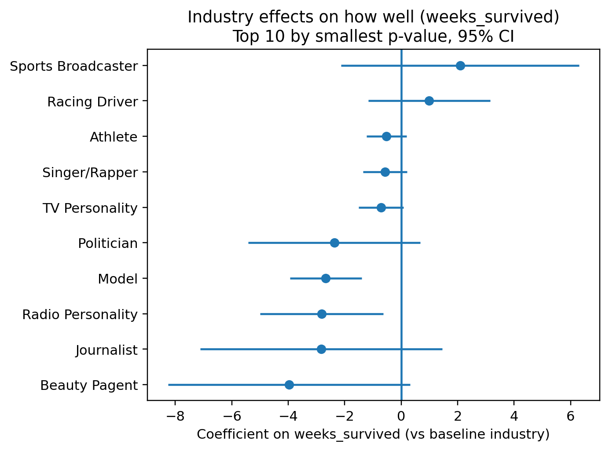
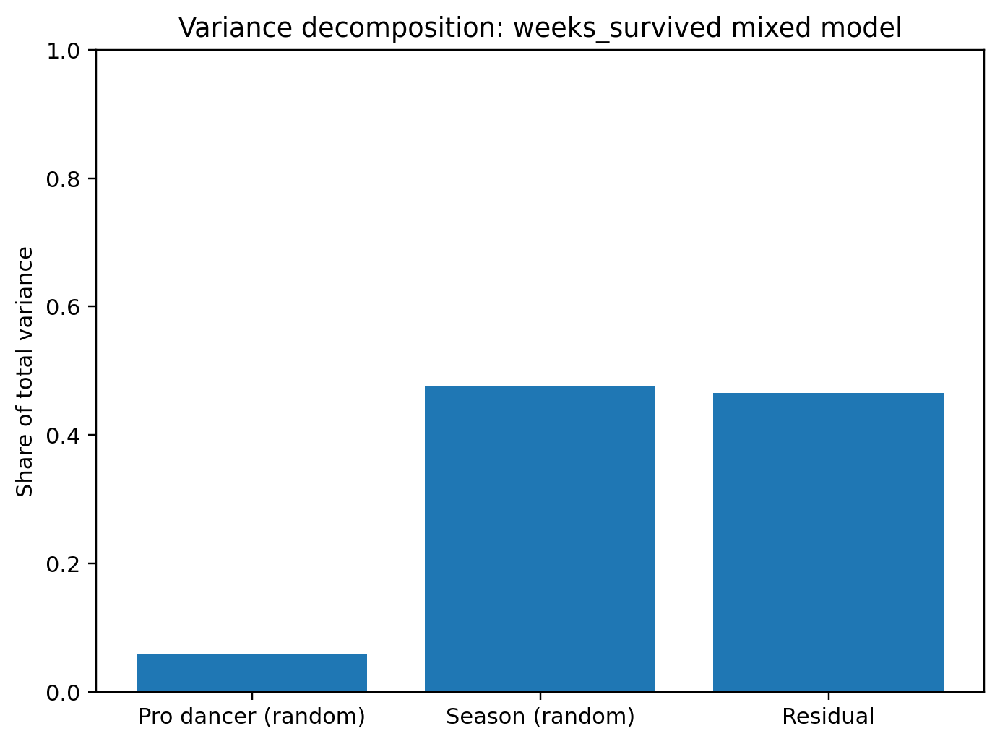
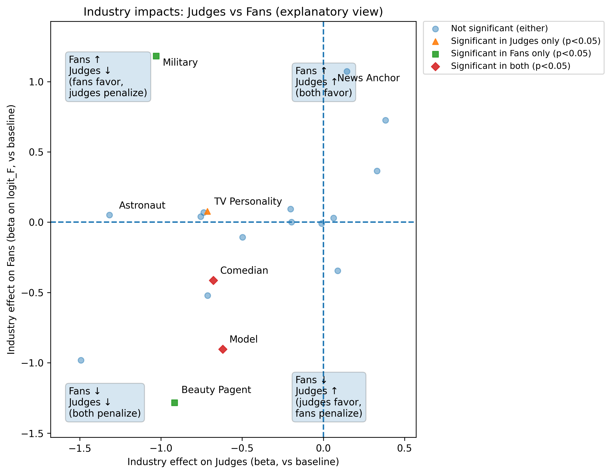
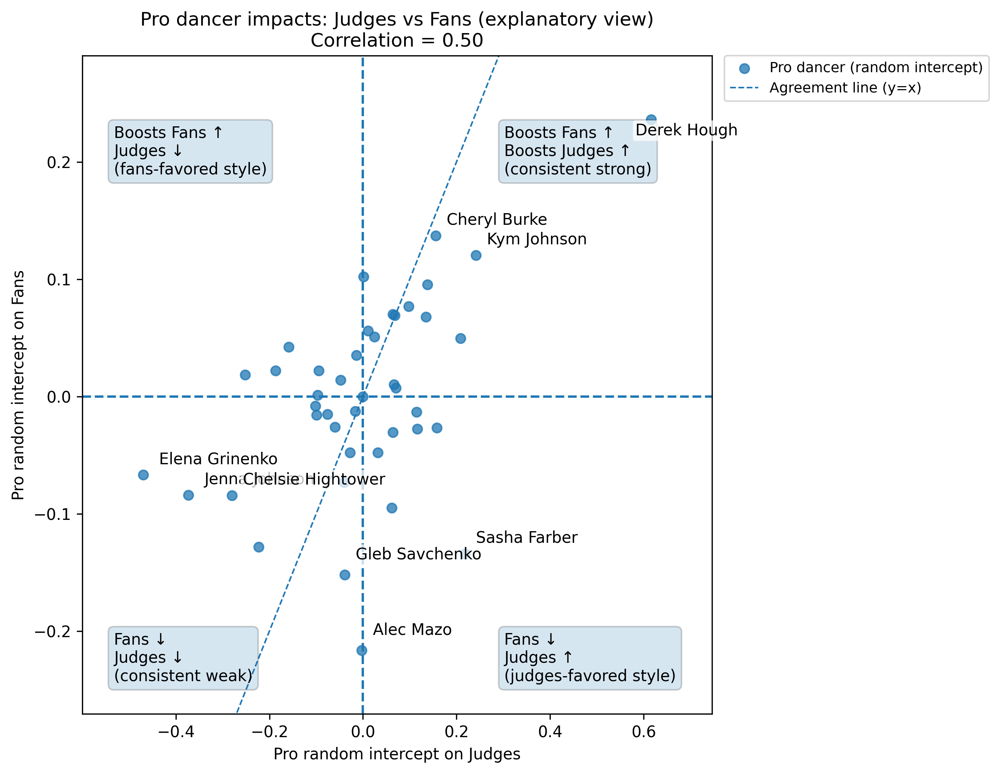
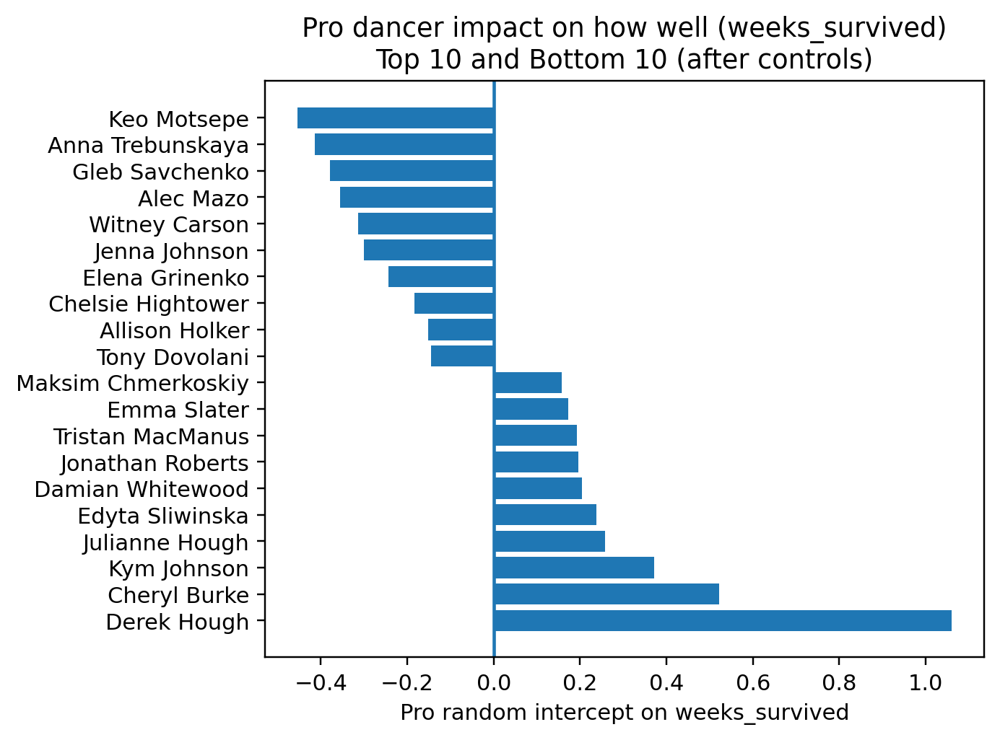

# Question 3：职业舞者与明星特征对比赛表现的影响（中文完整版初稿）

## Q3.1 研究问题与目标（Problem Restatement）

本题要求在已观测的评委评分数据基础上，结合我们在 Q1 中反演得到的粉丝投票估计（fan vote estimates），建立模型分析两类因素对比赛表现的影响：（1）职业舞者（pro dancer）带来的系统性差异；（2）明星自身属性（年龄、行业等）。核心问题包括：这些因素对选手“走多远/表现多好”的影响有多大？它们对评委评分与粉丝投票的影响方向与机制是否一致？

为保证回答可检验且可量化，我们将“表现好（how well）”定义为选手在赛季中坚持的周数（`weeks_survived`），并分别对评委评分（judges scores）与粉丝投票（fan votes）建立对应模型，在同一框架下比较同一特征在两套模型中的系数方向、显著性与量级，从而回答“是否以同样方式影响评委与粉丝”。

---

## Q3.2 数据构建与变量定义（Data Construction）

### Q3.2.1 周面板数据：评委与粉丝模型（Weekly Panel）

我们构建了以 *(season × week × celebrity)* 为粒度的周面板数据，用于评委模型与粉丝模型。为了降低“特殊周”（双淘汰、退赛、额外规则）对关系估计的干扰，主分析使用“单淘汰周”面板（main panel）。该面板具有如下质量特征：

- 每条记录均存在评委平均分（`judge_mean`）
- Q1 推断出的粉丝投票份额均可用（`F_mean` 非空）
- 每周所有在场选手的份额归一化检验通过（按周求和接近 1）

因此该面板适合进行稳定的回归/混合效应估计。

**变量定义如下：**

- **评委结果变量**：`judge_mean`（每周评委平均分）
- **粉丝结果变量**：`logit_F = log(F_mean/(1-F_mean))`  
  （因投票份额在 $(0,1)$ 区间，为适配线性误差结构，对份额进行 logit 变换）
- **控制变量**：赛季/周差异（season/week 相关控制），评委人数（`judge_count`）等
- **解释变量（固定效应）**：年龄（$age10 = age/10$），行业（`industry`）
- **随机效应（Random Effects）**：职业舞者 pro 的随机截距；明星（celebrity）随机截距（处理重复测量）

> 注：粉丝投票并非观测真值，而是 Q1 反演得到的后验均值/区间估计。主模型使用后验均值作为 proxy；其不确定性在局限性部分讨论。

---

### Q3.2.2 赛季汇总数据：表现模型（Season Summary）

为了直接回答题目中的 “how well a celebrity will do in the competition”，我们在 *(season × celebrity)* 粒度构建赛季汇总表，结果变量定义为：

- **`weeks_survived`**：该选手在赛季中坚持的周数（越大越好）

该表样本量为 281（覆盖多个赛季），`weeks_survived` 取值范围 1–10；包含约 42 位职业舞者与 20 个行业类别，可用于估计“个人特征 + pro dancer + 赛季差异”对最终走多远的影响。

---

## Q3.3 建模方法（Methodology）

### Q3.3.1 为什么使用混合效应模型（Why Mixed Effects）

本数据具有明显的层级结构：

1. **职业舞者（pro）跨赛季重复出现**：同一 pro 会与不同明星搭档出现在多个赛季；
2. **周面板存在重复测量**：同一明星会在多个周被重复观测；
3. **不同赛季存在系统差异**：赛季整体热度、评分尺度与赛制规则可能不同。

若使用普通线性回归，容易忽略组内相关性，导致标准误偏小或将组差异错误归因于固定效应。因此我们采用混合效应模型（Mixed-effects Models），将明星特征作为固定效应，将职业舞者（必要时还包括赛季与明星）作为随机效应，以分离“系统性偏移”（例如某些 pro 的稳定加成）与“个体/噪声波动”。

---

### Q3.3.2 模型 1：表现（weeks\_survived）

我们使用混合效应模型估计年龄与行业对“坚持周数”的影响，并引入职业舞者与赛季的随机截距：

$$weeks\_survived_{i,s} = \beta_0 + \beta_{age}\, age10_i + \beta_{ind}\, Industry_i + u_{pro(i)} + u_{season(s)} + \epsilon_{i,s}$$

其中：
- $u_{pro}$：职业舞者层面的系统差异（某些 pro 稳定更“带走远”）
- $u_{season}$：赛季整体差异（某些赛季整体更“难走远”或淘汰更激烈）
- $\epsilon$：随机误差

---

### Q3.3.3 模型 2：评委评分（judge\_mean）

在周面板下对评委评分建模：

$$judge\_mean_{i,t,s} = \beta_0 + \beta_{age}\, age10_i + \beta_{ind}\, Industry_i + \gamma_s + \delta_t + \beta_c\, judge\_count + u_{pro(i)} + u_{celebrity(i)} + \epsilon$$

其中：
- $\gamma_s,\delta_t$：分别用于控制赛季与周差异（评分尺度/主题周影响等）
- $u_{celebrity}$：明星随机截距，处理同一明星跨周重复测量导致的相关性

---

### Q3.3.4 模型 3：粉丝投票（logit(F)）

对 Q1 推断的粉丝投票份额做 logit 变换后建模：

$$logit(F_{i,t,s}) = \beta_0 + \beta_{age}\, age10_i + \beta_{ind}\, Industry_i + \gamma_s + \delta_t + \beta_c\, judge\_count + u_{pro(i)} + u_{celebrity(i)} + \epsilon$$

该模型用于回答年龄/行业/pro 是否显著影响粉丝投票偏好（通过 logit 份额的增减体现）。

---

### Q3.3.5 “评委 vs 粉丝”影响是否一致（Comparative Interpretation）

为回答 “Do they impact judges scores and fan votes in the same way?”，我们对比同一解释变量在评委模型与粉丝模型中的：

- 系数符号（正/负）
- 显著性（是否显著）
- 量级大小（效应强弱）

特别关注：哪些行业仅对评委显著、哪些仅对粉丝显著，以及年龄效应是否在两端一致。

---

## Q3.4 结果（Results）

### Q3.4.1 RQ1：哪些因素影响“走多远”（weeks\_survived）？影响多大？

**（1）年龄效应显著为负。**  
在控制行业、赛季差异与职业舞者影响后，年龄每增加 10 岁，`weeks_survived` 平均减少约 **0.54 周**（$\beta_{age10}=-0.541$, $p\approx 6.7\times 10^{-7}$）。这说明年龄与“走多远”呈显著负相关：年纪更大的明星平均更早出局。

**（2）行业存在少数显著差异。**  
相对基准行业，部分行业的 `weeks_survived` 系数显著为负，例如 `Model`（约 -2.67）、`Radio Personality`（约 -2.82），也存在边缘显著的行业差异（如 `Beauty Pagent`、`TV Personality`）。为保证论述清晰，正文建议挑选 2–3 个“显著且解释直观”的行业进行解释，并将其余行业完整结果放入附录或表格。

**图3.1** 行业对“走多远（weeks\_survived）”的影响系数与 95% 置信区间（相对基准行业；展示 $p$ 值最小的前若干行业）。

**（3）职业舞者影响存在但占比小，赛季差异占比更大。**  
通过方差分解，`weeks_survived` 的总变异中，赛季层面的随机效应占比约 **47.6%**，职业舞者随机效应占比约 **5.9%**，其余为残差（约 46.5%）。这表明：不同赛季整体环境对“走多远”影响最大；职业舞者确实有系统性影响，但相对较小。

**图3.2** `weeks\_survived` 混合效应模型方差分解：赛季差异贡献最大，职业舞者贡献较小但非零。

---

### Q3.4.2 RQ2：明星特征对评委与粉丝是否“同样方式”影响？

**（1）年龄在评委与粉丝两端均显著为负，但强弱不同。**

- 在评委模型中，年龄每 $+10$ 岁使评委平均分降低约 **0.36 分**（$\beta_{age10}=-0.3605$, $p\approx 3.5\times 10^{-26}$）。
- 在粉丝模型中，年龄每 $+10$ 岁使 $logit(F)$ 降低约 **0.085**（$\beta_{age10}=-0.0854$, $p\approx 0.002$），对应投票 odds ratio 约为：

$$\exp(-0.0854)\approx 0.918$$

即投票优势约下降 **8.2%**。

因此，年龄对评委与粉丝的影响方向一致（都更偏好年轻），但评委端的惩罚更强、更显著。

**（2）行业效应存在明显不一致。**  
对比评委与粉丝模型的行业系数发现：一些行业在两端均显著且同向；但也存在“只影响评委”或“只影响粉丝”的行业。例如 `TV Personality` 在评委端更显著，而 `Military` 等行业在粉丝端更显著。该结果说明：行业对评委与粉丝的影响并非完全一致，反映了“专业评价标准”与“观众偏好”的结构性差异。

**图3.3** 行业效应在评委端与粉丝端的散点对比（解释风）：横轴为评委端行业系数，纵轴为粉丝端行业系数（logit 份额尺度）。四象限文字框用于解释“评委偏好/粉丝偏好”的一致或分歧；标注点为显著或差异较大的行业。

---

### Q3.4.3 RQ3：职业舞者是否“带分/带票/带走远”？一致吗？

我们将职业舞者作为随机截距估计其“系统性偏移”（在控制年龄、行业、赛季/周等因素后）。比较职业舞者在评委与粉丝模型中的随机效应可得到：两者相关系数约 **0.50**，为中等正相关。这意味着：部分职业舞者既能提升评委得分也能提升粉丝投票，但并非完全一致，存在“更偏评委认可”或“更偏粉丝偏好”的职业舞者类型。

结合象限解释图可以进行案例讨论：  
- 右上象限表示“两端都强”（既带分也带票）；  
- 右下/左上象限表示“两端分歧”（例如更受评委认可但未必带票，或相反）。

**图3.4** 职业舞者随机效应（评委 vs 粉丝）散点对比（解释风）：横轴为评委模型中的 pro 随机截距，纵轴为粉丝模型中的 pro 随机截距。四象限文字框用于解释“带分/带票”的一致或分歧；标注点为极端或分歧较大的职业舞者。

（可选）若需要进一步展示“带走远”，可以给出职业舞者对 `weeks_survived` 的 Top/Bottom 排名：

**图3.5** 控制年龄、行业与赛季差异后，职业舞者对 `weeks\_survived` 的随机效应排名（Top/Bottom）。

---

## Q3.5 讨论（Discussion）

综合三类结果可以得到一致的解释框架：

1. **年龄对评委与粉丝均为负向影响，且评委端更敏感。**  
   这可能反映了技术完成度、体能与动作质量在评委评分中的权重更高；粉丝端虽也偏好年轻选手，但偏好强度较弱。

2. **行业效应在评委端与粉丝端并不完全一致。**  
   这说明“专业评价标准”与“观众偏好”存在结构性差异：某些行业标签可能更能吸引观众投票，但不一定带来更高的评委评分，反之亦然。

3. **职业舞者确实对结果有系统性贡献，但在“走多远”这一总体结果上赛季差异更关键。**  
   方差分解显示赛季层面的差异贡献最大，职业舞者影响较小但非零，说明 pro 的加成是“增益项”，而比赛整体环境（赛季）对最终走多远具有更强的决定性影响。

---

## Q3.6 局限性与稳健性（Limitations & Robustness）

本研究的粉丝投票来自 Q1 反演估计而非观测真值，因此存在后验不确定性。主分析使用后验均值作为 proxy；未来可进一步将后验方差或区间宽度纳入权重回归，或对后验样本进行多重抽样以传播不确定性。

此外，主分析基于单淘汰周以减少规则扰动，可能牺牲部分样本。可在包含特殊周的面板上重复估计并加入特殊周指示变量进行稳健性检验，从而验证结论的稳定性。最后，本模型识别的是统计关联而非严格因果效应，因而解释应避免“因果断言”。

---

## Q3.7 结论（Direct Answers）

职业舞者与明星特征均会影响比赛表现。年龄对 `weeks_survived`、评委评分与粉丝投票均呈显著负向影响，其中评委端效应更强；行业在评委与粉丝端的影响并不完全一致，揭示了专业标准与观众偏好的差异。职业舞者存在系统性“带分/带票/带走远”效应，但对 `weeks_survived` 的解释力相对较小，而赛季层面的整体差异贡献最大。

